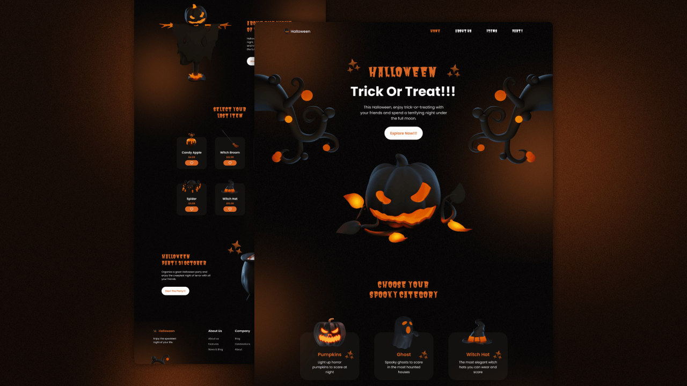

# Create a Responsive Halloween Website Design Using HTML CSS & JavaScript 
 
 Criação de um site com tema sobre Halloween para treino e fixação de conteúdo.
   

---
<h3 align="center">
  <a href="https://matheusmanuel.github.io/responsive-halloween-website/">Acessar demonstração</a>
</h3>

# Descrição
Criação de um site com tema sobre Halloween para treino e fixação de conteúdo usando html,css e js. [@BedimCode](https://www.youtube.com/c/Bedimcode)
